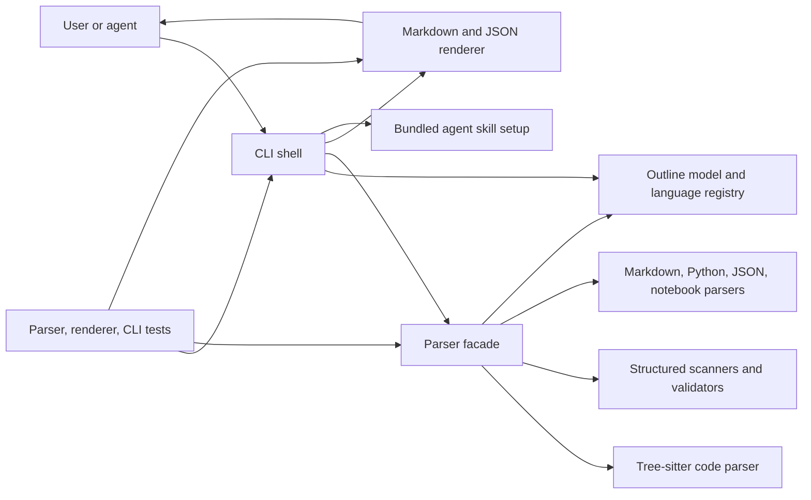
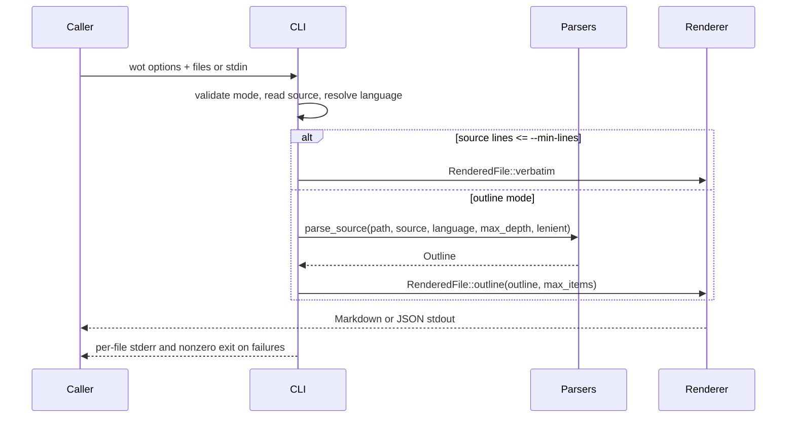

# Architecture

## Project Overview

`wot` is a Rust CLI and library for turning explicit source, config, and document
files into compact, agent-friendly context. Its primary consumers are humans and
agents that need quick file outlines, Markdown snippets, or machine-readable JSON
without opening whole files.

The main runtime surface is the `wot` binary. The library modules expose the same
core parser and renderer building blocks for tests and future integrations. The
project does not own durable application data; it reads caller-provided files or
stdin and writes outlines, verbatim content, supported-language metadata, and
errors to stdout/stderr.

## Table Of Contents

- architecture overview: L29-L61
- boundaries and invariants: L63-L82
- repository mapping: L84-L101
- components: L103-L172
- data and control flow: L174-L198
- public surfaces: L200-L216
- extension points: L218-L228
- testing and verification: L230-L244
- change management: L246-L251
- architecture discussion: L253-L273

## Architecture Overview

The normal runtime path is a thin CLI shell that validates input mode, reads
sources, chooses or forces a language, delegates parsing, applies output budgets,
and delegates final output formatting to the renderer.



The product shape has five major parts:

- `src/model.rs` defines the shared outline, range, node-kind, and language
  vocabulary.
- `src/parsers.rs` routes a selected `Language` to concrete parser modules.
- `src/parsers/*` builds `Outline` trees from specific file families.
- `src/renderer.rs` owns Markdown, JSON, supported-language output, and node
  budgeting.
- `src/cli.rs` owns argument parsing, input reading, per-file error collection,
  and process exit behavior.

## Boundaries And Invariants

- The CLI must stay a shell over model, parsers, and renderer. It may coordinate
  IO and errors, but parser semantics and output formatting belong outside it.
- All parser backends produce the shared `Outline` and `OutlineNode` model. New
  formats should extend `Language`, `NodeKind`, and parser tests before changing
  the CLI surface.
- Ranges are source-oriented and 1-based. Line ranges are inclusive; precise
  ranges use start-inclusive/end-exclusive columns.
- Language detection is deterministic and based on explicit file names,
  extensions, or `--language`. Unsupported files remain unsupported unless the
  caller forces a language.
- Markdown is the default human output. JSON is the machine output and must stay
  valid even when some input files fail.
- `--max-items` applies a deterministic preorder cap after parsing. `--max-depth`
  limits parser traversal before rendering.
- `--min-lines` defaults to `40` and only applies after language recognition. It never converts
  unsupported files into accepted input.
- `cargo install` must not write agent configuration as a build side effect.
  `wot setup` owns skill installation explicitly.

## Repository Mapping

- `src/main.rs` is the binary entry point. It must not contain product logic.
- `src/cli.rs` is the command adapter. It may depend on parser, renderer, model,
  and error modules, but parser modules should not depend on it.
- `src/model.rs` is the shared contract between parsing, rendering, and tests.
- `src/source_map.rs` translates byte offsets to user-facing source positions.
- `src/parsers.rs` is the parser facade and dispatch table.
- `src/parsers/` contains format-specific parser implementations and helper
  scanners. Parser modules may depend on `model`, `source_map`, and local parser
  helpers, but not on CLI rendering.
- `src/renderer.rs` is the output boundary for Markdown, JSON, supported-language
  lists, truncation metadata, and verbatim entries.
- `skills/create-file-outline/SKILL.md` is a bundled agent-facing usage surface.
- `tests/` owns parser, renderer, language detection, source mapping, and CLI
  behavior coverage.
- `build.rs` only tracks skill changes for rebuilds and must stay free of
  install-time filesystem side effects.

## Components

### Outline Model

`src/model.rs` owns the durable vocabulary: `Language`, `LanguageSpec`,
`Outline`, `OutlineNode`, `NodeKind`, `SourceRange`, and `Position`. It is the
contract all parser backends and renderers share. It also owns language aliases,
extension and filename detection, backend metadata, and display names used by
`--language`, `--list-supported`, and JSON output.

The model has no IO side effects. Its tests are mostly indirect through language
detection, parser, renderer, and CLI tests.

### Parser Facade And Backends

`src/parsers.rs` owns parser selection. It exposes path-based parsing for legacy
callers and source-based parsing for file and stdin inputs that already know the
language. The facade is the only place that maps a `Language` enum to a concrete
parser backend.

Tree-sitter-backed code parsing lives in `src/parsers/tree_sitter_code.rs` and
covers Rust, TypeScript/JavaScript, Go, C/C++, Java, Kotlin, C#, shell, Clojure,
and Emacs Lisp. It extracts high-value syntactic declarations such as imports,
exports, modules, classes, functions, methods, types, shell functions, and Lisp
forms.

Structured and document parsers live in dedicated modules for Markdown, Python,
JSON, YAML, TOML, INI, dotenv, XML, HCL/Terraform, Dockerfile/Containerfile, and
Jupyter notebooks. YAML and TOML validate in strict mode and can skip validation
for lenient partial outlines. HCL and XML support partial output for selected
unclosed structures in lenient mode. JSON and notebooks remain strict unless
small-file verbatim mode is selected.

### Source Mapping

`src/source_map.rs` owns byte-offset to line and column conversion. Parsers use it
when they need source-derived ranges from scanner offsets. Tree-sitter parsers
use parser-provided row positions directly. Keeping this helper small preserves a
single convention for precise ranges across output formats.

### Renderer

`src/renderer.rs` owns output shaping after parsing. It converts `Outline` values
into `RenderedFile` entries, applies preorder node caps, reports truncation and
omitted-node counts, formats Markdown output, emits JSON response objects, and
renders supported-language metadata.

This module is the boundary that keeps `src/cli.rs` from learning the details of
JSON schemas or Markdown list formatting. Renderer tests cover nested Markdown,
precise ranges, and budgeting behavior through CLI tests.

### CLI Shell

`src/cli.rs` owns the `clap` argument model and process workflow. It validates
mutually exclusive input modes, reads files or stdin, resolves forced languages,
chooses verbatim versus outline mode, collects per-file errors while continuing
later files, delegates parsing, delegates rendering, and returns a nonzero
process result when any input fails.

The CLI does not own parser semantics or output schemas. CLI tests verify default
headers, JSON validity, continued processing after errors, list-supported output,
budgeting, stdin, forced language parsing, and lenient parse mode.

### Skill Setup

`wot setup` installs `skills/create-file-outline/SKILL.md` into agent skill roots.
By default it writes to the current project's `.agents/skills` tree. `-g` switches
the base to the user's home directory, and `--claude` mirrors the install into
the matching `.claude/skills` tree. This is an explicit developer action, not a
side effect of `cargo install`.

## Data And Control Flow



For multiple file inputs, the CLI processes paths in caller order and appends
successful entries in that same order. Errors are collected separately so JSON
output remains a valid response object and Markdown output can still include
later successful files before the process exits nonzero.

## Public Surfaces

- `wot [OPTIONS] <file>...` is the main command. `wot --help` is the exhaustive
  flag reference.
- `--format markdown|json` selects human or machine output.
- `--list-supported` lists language ids, aliases, extensions, filenames, and
  backend names. It is the authoritative installed-format inventory.
- `--language` and `--stdin` let callers bypass path detection for extensionless
  files and piped content.
- `wot setup` installs the bundled skill into project-local `.agents`; `-g`
  installs globally under `~/.agents`; `--claude` also installs into `.claude` or
  `~/.claude`.
- The JSON response schema has top-level `files` and `errors` arrays. Outline
  entries include `nodes`, `truncated`, and `omitted_nodes`; verbatim entries
  include `content`.
- `skills/create-file-outline/SKILL.md` is the bundled Codex skill surface and
  intentionally points agents back to `wot --help` for current details.

## Extension Points

- Add a language by extending `Language`, `Language::from_path`,
  `Language::from_name`, `Language::supported_specs`, `NodeKind` if needed, and
  `src/parsers.rs`.
- Add a parser backend under `src/parsers/` and keep source-range behavior aligned
  with `SourceRange`.
- Add output modes in `src/renderer.rs`; add CLI flags only as adapters to that
  renderer behavior.
- Extend public docs and the bundled skill whenever supported formats or default
  behavior changes.

## Testing And Verification

Parser tests cover file-family structure, nesting, line ranges, max-depth, invalid
input, redaction, and lenient behavior where available. CLI tests cover
multi-file ordering, unsupported-file failure behavior, JSON output, stdin,
forced languages, headers, budgets, and list-supported output. Renderer and
source-map tests pin formatting and range behavior independently of full CLI runs.

The release verification gate is:

```bash
rtk cargo test
rtk cargo fmt --check
rtk cargo clippy --all-targets --all-features
```

## Change Management

Update this document when a change moves responsibilities between CLI, parser,
model, renderer, setup, or build-script boundaries; changes JSON schema or
Markdown formatting; adds or removes supported language families; changes range
semantics; or changes skill installation behavior.

## Architecture Discussion

The current architecture follows the local guidance that the CLI should be thin
and parser/rendering responsibilities should stay behind dedicated modules. The
main coupling risk from the output-controls work was that CLI code briefly owned
the `RenderedFile` output model, node budgeting, and JSON/Markdown formatting.
That gap is now closed: `src/renderer.rs` owns output shaping, while `src/cli.rs`
coordinates IO and process policy.

Dependency direction is straightforward: parser and renderer modules depend on
the shared model, while the CLI depends on both as an adapter. Parser backends do
not depend on CLI behavior. Side effects are concentrated in `src/cli.rs`: runtime
input/output, explicit `wot setup` skill installation, and filesystem reads for
explicit user inputs.

The remaining architectural delta is mostly about scale. `src/model.rs` currently
owns both the core outline model and the complete language registry. That is
acceptable at the current size, but a future expansion into many more languages
may justify extracting registry metadata into a dedicated module so the pure
outline model stays smaller. The current tests make that extraction low risk when
it becomes necessary.
